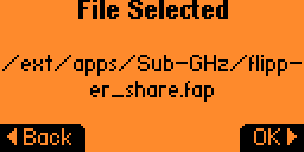
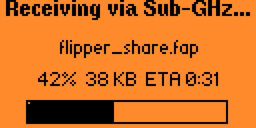
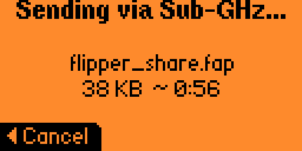

# Flipper Share - direct file transfer between flippers

## Overview

**Flipper Share** is a wireless-enabled file sharing application for Flipper Zero.

It allows to send any file over a Sub-GHz via internal transmitter directly from one Flipper Zero to another without any additional hardware, cables, smartphones, computers, internet connection and magic needed.

Actual file transfer speed via **Flipper Share** is around 700 Bytes/sec (42 KB/min), that allows to transfer average .fap file from one Flipper to another in less than 1 minute.

File size tested is 32 MB (~13 hours), but the protocol itself can support up to 4 GB (uint32_t file size). Maximum file size is limited by the Flipper Zero's free RAM on receiver side, actually should be not more than 35MB.

If you prefer to use the **Infrared** channel instead of Sub-GHz, consider using **Flipper Share IR** app for that ([link](https://github.com/lomalkin/flipper-zero-apps/blob/-/flipper_share_ir/README.md)).

Features:

- Works from out of the box on any Flipper Zero, the simplest possible way to transfer files directly
- Multiple receivers supported simultaneously and works just fine (broadcast)
- Continuation of download / auto retries in case of packet loss is guaranteed at the protocol level
- Integrity check with MD5 hash after file reception
- No pairing or explicit session establishment needed
- No encryption, anyone nearby can receive the file, please don't send sensitive data
- Fun torrent-like progress bar showing completely received parts of the file instead of boring usual percentage scale

Please feel free to open an issues and PRs if you have any ideas or found bugs.

# Usage

1. On the receiving Flipper: open Flipper Share → **Receive**.
2. On the sending Flipper: open Flipper Share → **Send** → pick a file → **OK**.
3. Wait for the transfer to complete. The receiver shows a progress bar and
   verifies the MD5 hash at the end; the file is saved to `/ext/inbox/`.

| Sender                                                                     | Receiver                                                                                 |
|:--------------------------------------------------------------------------:|:----------------------------------------------------------------------------------------:|
|                  |  |
|              |          |
|        |       |

# Credits

Special thanks to [@Skorpionm](https://github.com/Skorpionm/) for building a solid foundation with the Sub-GHz packet abstraction layer API — it made this app possible, convenient, and reliable.

---

# Flipper Share protocol

## Packet structure

Each packet is **60 bytes long** (due to Flipper CC1101 limitations).

| Field         | Size     | Type                 |
|---------------|----------|----------------------|
| `version`     | 1 byte   | uint8_t              |
| `tx_id`       | 1 byte   | uint8_t              |
| `packet_type` | 1 byte   | uint8_t              |
| `payload`     | 56 bytes | variable (see below) |
| `crc`         | 1 byte   | uint8_t              |

## Payloads by `packet_type`

### `0x01` — Announce

| Field        | Size     | Type                  |
|--------------|----------|-----------------------|
| `file_name`  | 36 bytes | char[36], zero-padded |
| `file_size`  | 4 bytes  | uint32_t              |
| `file_hash`  | 16 bytes | char[16], MD5         |

### `0x02` — Request range

| Field      | Size     | Type     |
|------------|----------|----------|
| `start`    | 4 bytes  | uint32_t |
| `end`      | 4 bytes  | uint32_t |
| `padding`  | 48 bytes | zero     |

### `0x03` — Data

| Field        | Size     | Type     |
|------------- |----------|----------|
| `block_num`  | 4 bytes  | uint32_t |
| `block_data` | 52 bytes | raw data |

## Example session

**Sender:**
- User selects a file to share.
- The sender prepares the **announce** packet with file metadata and random **tx_id**.
- The sender sends the **announce** packet periodically (every 3 sec)
- When received a **request range** packet, the sender:
    - Checks if the **tx_id** matches the expected one.
    - Checks if the **start** and **end** are within the file size.
    - Sends **data** packets for each block in the requested range.
        - Each **data** packet contains a **block_num** and **block_data**.
        - The sender continues sending data packets until all requested blocks are sent.

**Receiver:**
- The receiver listens for **announce** packets.
- When received an **announce** packet, the receiver displays the file information.
    - Receiver locks to first valid received announce's **tx_id**.
    - Saves **file_name**, **file_size**, and **file_hash** to internal state.
    - Allocates file **file_name** in output directory.
    - Creates map of received blocks (count calculated from **file_size** and actual block size).
    - The receiver sends a one-time **request range** packet with full file range to start a transfer.
- On received a **data** packet, the receiver:
    - Checks if the **tx_id** matches the expected one.
    - Checks if the **block_num** is in range.
    - Saves the block data to the file.
- If there are no other communications:
    - The receiver waits for some timeout and sending **request range** for the first missing blocks region. It can be optimized better in future without breaking compatibility with old versions.
- If all blocks are received, the receiver:
    - Calculates MD5 hash of the received file.
    - Compares it with the announced **file_hash**.
    - Receiving if finished successfully or with errors (if hash mismatch).

If you implement this protocol or similar in other applications or devices, I’d be happy to hear about it — please let me know!
