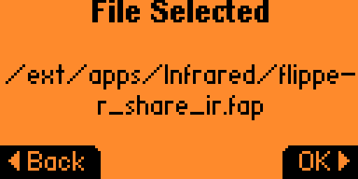
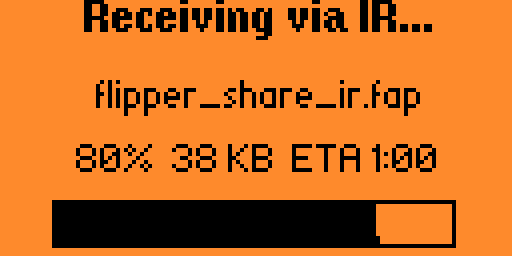
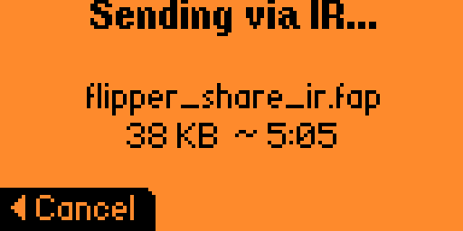

# Flipper Share IR — direct file transfer between Flippers over IR

## Overview

**Flipper Share IR** transfers any file directly from one Flipper Zero to another over the **Infrared** channel — using only the onboard IR LED (transmitter) and the TSOP demodulating receiver. No extra hardware, cables, phones, computers, internet or radio is needed.

It is a rewrite of Flipper Share with the transport replaced by a custom IR modem. The basics of the classic flipper_share file-transfer protocol (resumable, integrity-checked) is preserved.

Actual file transfer speed via **Flipper Share IR** is around 130 Bytes/sec (7.6 KB/min), if you need to achieve higher throughput, consider using the original **Flipper Share** app over Sub-GHz ([README.md](https://github.com/lomalkin/flipper-zero-apps/blob/-/flipper_share_ir/README.md)).

File size tested is 8 MB (~17 hours), but the protocol itself can support up to 4 GB (uint32_t file size). Maximum file size is limited by the Flipper Zero's free RAM on receiver side, actually should be not more than 35 MB.

Features:

- Works out of the box on any Flipper Zero — the IR hardware is built in.
- Integrity check with an MD5 hash after reception; per-packet CRC16.
- Automatic retransmission of lost/corrupted packets — the transfer continues "until success" (or until you restart it manually).
- Half-duplex link (the side that listens stays silent), matching the hardware.
- Torrent-like progress bar on the receiver; filename/size and ETA on the sender.
- Designed to avoid triggering nearby TVs / AV gear (the sync pulse and symbol timings do not match any common consumer IR protocol).
- No pairing needed; no encryption (anyone in the IR beam can receive — don't send sensitive data).
- Multi-receiver (broadcast) is not supported but actually works fine on small amount of receivers.

IR is directional and unregulated; aim the two units at each other, fairly close, for best results. Throughput is lower than radio (IR is a slow, half-duplex, line-of-sight link) but robust.

# Usage

1. On the receiving Flipper: open Flipper Share IR → **Receive**.
2. On the sending Flipper: open Flipper Share IR → **Send** → pick a file → **OK**.
3. Keep the two IR windows (top edge) pointed at each other until it completes.
   The receiver shows a progress bar and verifies the MD5 hash at the end; the
   file is saved to `/ext/inbox/`.

| Sender                                                               | Receiver                                                                          |
|:--------------------------------------------------------------------:|:----------------------------------------------------------------------------------:|
|            |  |
|        |        |
|       |  |

---

# Flipper Share IR protocol

The design is a two-layer stack: a byte-oriented **IR modem** (physical/link
layer) under the existing **file-transfer protocol** (selective-repeat ARQ).

## Physical layer — the IR modem

- Carrier: **38 kHz**, ~33% duty (so the onboard TSOP passes it). Reception is the
 demodulated envelope only (mark = carrier burst, space = gap).
- **Line code:** a fixed short *mark* acts as a clock tick; the following *space*
  encodes the data as one of `2^BITS_PER_SYMBOL` discrete durations (pulse-position
  modulation). Information rides in spaces because a TSOP reports gap lengths more
  cleanly than burst lengths. Default: 3 bits/symbol.
- **Framing:** a leading gap, then a distinctive `SYNC` mark+space, then the data
  symbols, then a trailing mark that closes the last space. Frames are delimited by
  a short silence, so a corrupted frame only loses itself and the next re-syncs.
- **Whitening:** each packet's bytes are XORed with a fixed LFSR keystream so the
  modulated envelope stays irregular even for repetitive data (avoids TSOP AGC
  suppression of "noise-like" regular signals).
- **Collision avoidance:** the data mark (~400 µs) sits between the data-bit marks
  of consumer protocols, and the SYNC mark (~1800 µs) matches no protocol preamble,
  so nearby remotes' receivers should not decode our frames.
- All physical-layer parameters live in `ir_modem_config.h` (recompile to tune).

## Packet structure

Every packet: `[version(1)][tx_id(1)][packet_type(1)][payload][crc16(2)]`.
The payload length depends on the type, so the DATA packet size is tunable and
decoupled from the control packet (which must hold the file metadata).

### `0x01` — Announce (control payload)

| Field       | Size     | Type                  |
|-------------|----------|-----------------------|
| `file_name` | 36 bytes | char[36], zero-padded |
| `file_size` | 4 bytes  | uint32_t              |
| `file_hash` | 16 bytes | MD5                   |

### `0x02` — Request range (control payload)

| Field     | Size    | Type     |
|-----------|---------|----------|
| `start`   | 4 bytes | uint32_t |
| `end`     | 4 bytes | uint32_t |
| padding   | rest    | zero     |

### `0x03` — Data (data payload)

| Field        | Size               | Type     |
|--------------|--------------------|----------|
| `block_num`  | 4 bytes            | uint32_t |
| `block_data` | ISH_DATA_LENGTH    | raw data |

## Session

- **Sender** announces the file (name, size, MD5) periodically until a receiver
  locks on, then streams the requested DATA blocks and returns to listen after each
  bounded chunk.
- **Receiver** locks to the first valid announce (`tx_id`), preallocates the file,
  and requests missing block ranges (bounded per request) on timeout. It writes
  each block once (duplicates ignored) and, when all blocks are in, computes the
  MD5 and compares it to the announced hash.
- Lost or corrupted (CRC16-failing) packets are simply re-requested, so the
  transfer converges.

# Credits

Derived from Flipper Share. IR modem and transport built on the Flipper firmware
`furi_hal_infrared` raw TX/RX API.
