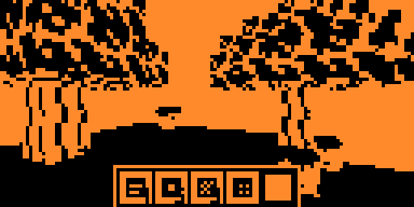
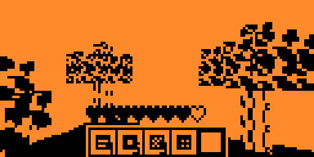
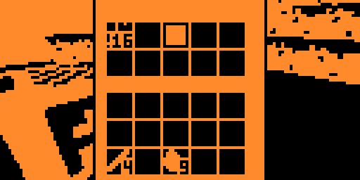
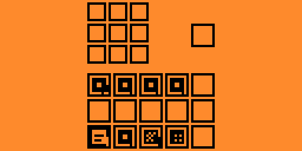
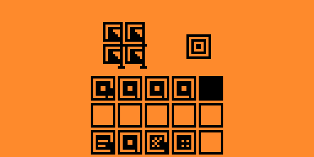
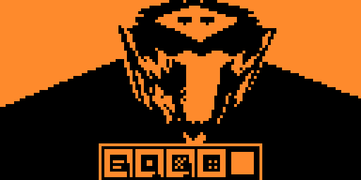
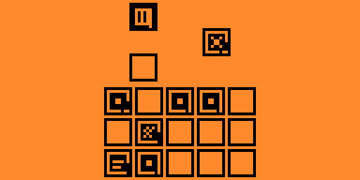

# Flipcraft

## Screenshots

| World | World | Inventory |
|---|---|---|
|  |  |  |

| Crafting | Crafting | Crafting |
|---|---|---|
|  |  |  |

| Storage | Furnace | Menu |
|---|---|---|
|  |  |  |

| Menu | Menu |
|---|---|
|  |  |

## Controls

### World

- `Up` / `Down`: move forward / backward
- `Left` / `Right`: turn left / right
- `Ok` + `Up` / `Down`: look up / down
- `Ok` + `Left` / `Right`: select previous / next hotbar slot
- `Ok` short press: place block, use the targeted station, or attack the creature in front of you
- `Ok` long press: mine or break the targeted block; on a wild wolf: tame it (costs 2 apples)
- `Back` short press: jump
- `Back` long press: open inventory

Aiming at creatures is forgiving: any creature in the middle half of the
screen counts as targeted, no pixel-perfect crosshair needed. Blocks still
require the exact crosshair.

## Creatures

Three species roam the world. Sheep are common; wolves and creepers are
equally rare. Every creature has 2 HP: any sword kills in one hit, bare
hands or tools in two. A hurt creature flashes inverted for about a second.
Creatures are not saved with the world.

- **Sheep** (passive). Grazes, flees when hit. Drops an apple (meat).
- **Wolf** (neutral). Leaves you alone until you hit it, then it bites back
  (1 heart per bite). Wolves hunt sheep and creepers on their own: against a
  creeper a wolf bites and springs away, but sometimes it lingers too long
  playing and the blast takes both - the duel is roughly 50/50. Drops an
  apple (meat).
- **Creeper** (hostile). Stalks you from up to 6 blocks. Next to its target
  it freezes, flashes and swells for ~2 seconds, then explodes: a 3x3x3
  crater, chests and furnaces are destroyed with their contents, and anyone
  within 2.5 blocks - you included - loses ~90% of max health. Run more
  than 4 blocks away to disarm it. Drops gunpowder on **any** death,
  exploded or slain.

### Taming

Hold `Ok` on a wild wolf while carrying at least 2 apples: the apples are
consumed and the wolf becomes yours. A tamed wolf never bites you, follows
you everywhere and guards you: it still pounces on sheep and creepers by
itself, but never strays further than 3 blocks from you.

## Dynamite

Craft: 1 sand + 1 gunpowder side by side (any order, horizontal or
vertical) = 1 dynamite. Stacks like any material.

- Place it like a normal block; it is harmless until lit.
- `Ok` short press on a placed dynamite lights the fuse: it flashes for
  about 3 seconds (falls if unsupported), then explodes exactly like a
  creeper.
- The explosion **ignites any adjacent dynamite** with a short random
  delay - line up charges for a chain reaction.
- `Ok` long press breaks an unlit dynamite back into the item.

### Menus

- `Up` / `Down` / `Left` / `Right`: move cursor
- `Ok`: pick up, place, or take output
- `Ok` + arrow: drop one held item per slot crossed
- `Back`: close menu

### System

- `Ok` + `Back`: quit (bug press first "OK")
