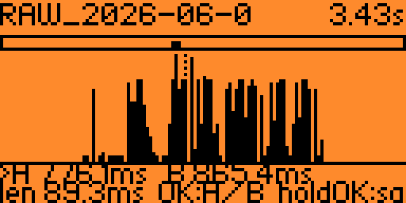
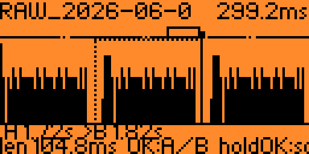
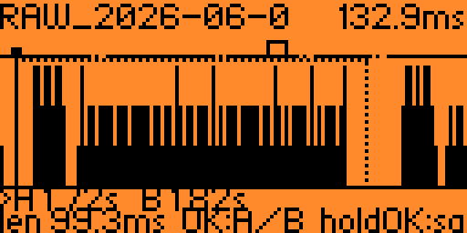
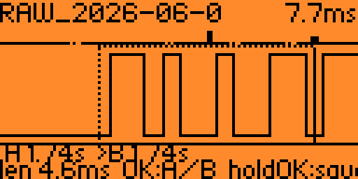
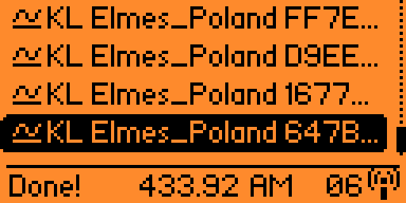
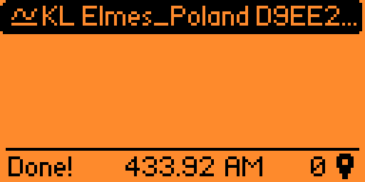

https://github.com/user-attachments/assets/364dd228-55be-410a-bbef-03b2faa2bac2

# Sub-GHz .sub RAW Files Editor for Flipper Zero

A tiny on-device waveform editor for **Flipper Zero** that trims RAW `.sub`
captures down to just the part you care about. Open a recording, let the app
find the actual signal hiding inside a long stretch of silence, slide two
markers to the start and end of one clean frame, and save it as a new `.sub`.

Built for cleaning up `Read RAW` captures before decoding or replaying them -
a long recording full of repeats and noise becomes a single tidy frame.

> **Receive/analysis only.** This app never transmits. It only reads, displays
> and rewrites files you already have on the SD card.

## Screenshots

Zooming from the full activity envelope all the way down to individual pulses,
then a trimmed single frame decoding cleanly as the original remote:

| Envelope (zoomed out) |
|:---:|
|  |

| Zooming in | Zooming in (deeper) | Square wave (maxium deep) |
|:---:|:---:|:---:|
|  |  |  |

A frame trimmed with this app, decoded back by the Flipper's Sub-GHz reader:
| Decoded original | Decoded middle frame (trimmed) |
|:---:|:---:|
|  |  |

> **A note on this example.** The capture shown here decodes fine on its own —
> several consecutive frames that the Flipper recognises and can save directly,
> so there's no real need to crop it. It's used here only because it's a
> familiar, easy-to-read signal that makes the tool's behaviour obvious. The
> app earns its keep on the captures that *don't* decode automatically: a frame
> buried in noise, a recording with several different signals in it, or a burst
> you want to isolate down to a single clean copy before analysing or
> replaying it.

---

## Why

`Read RAW` on the Flipper records a continuous stream of pulse/gap durations. A
single button press on a remote often lands in the middle of seconds of
silence, repeated frames, and background noise. Most decoders work best on one
clean copy of the frame. Trimming that by hand means editing the `.sub` text
file on a computer and guessing where the signal starts. This app does it
visually, on the device.

## Features

- **Auto-locates the signal.** On open it scans the whole capture, finds the
  longest clean burst (the most complete frame copy) and jumps the view there
  with the A/B markers already placed around it - no scrolling through empty
  space.
- **Two view modes, switched automatically by zoom:**
  - *Envelope* when zoomed out - bar height shows signal activity, so you can
    see at a glance where the bursts are. Note that the Y axis is edge density,
    not amplitude.
  - *Real square wave* when zoomed in past ~30 ms - inspect individual pulses
    to place cuts precisely.
- **Overview strip** along the top shows the whole recording with a bracket
  marking where your current zoomed view sits.
- **Zoom out past the edges** of the data, so a short burst is shown with empty
  margins on both sides (a clean "silence -> frame -> silence" picture).
- **Memory-safe.** Long silence gaps are clamped to fit a compact `int16`
  buffer, the buffer grows in small chunks and shrinks to the file's real size
  after loading. If there genuinely isn't enough free RAM, you get a clear
  "reboot and try again" message instead of a crash.
- **Clean output.** The saved frame is aligned to start on a pulse and end on a
  gap, with the original `Frequency` and `Preset` preserved.

## Controls

| Button       | Action                                          |
|--------------|-------------------------------------------------|
| Left / Right | Move the active cut marker (hold = move faster) |
| Up / Down    | Zoom in / out (centered on the active marker)   |
| OK (short)   | Switch the active marker between **A** and **B**|
| OK (hold)    | Save the trimmed file                           |
| Back         | Exit                                            |

The active marker is the one drawn as a solid line with a small box on top, and
marked with `>` in the bottom bar. The other marker is dotted.

## Build

Works with the official firmware, Momentum, Unleashed and other forks.

### With your firmware tree (fbt)

```bash
# copy the folder into the firmware sources
cp -r subghz_raw_edit <firmware>/applications_user/subghz_raw_edit

cd <firmware>
./fbt fap_subghz_raw_edit
# result: build/latest/.extapps/subghz_raw_edit.fap
```

Build it from the **same firmware tree** that's flashed on your Flipper,
otherwise you'll get an "Outdated app" / API mismatch error.

Build and run on a connected device in one step:

```bash
./fbt launch APPSRC=applications_user/subghz_raw_edit
```

### With ufbt (standalone, no firmware tree)

```bash
pip install --upgrade ufbt
ufbt update --channel=release        # or point at your fork's SDK
# from the subghz_raw_edit/ folder:
ufbt                                 # builds dist/subghz_raw_edit.fap
ufbt launch                          # builds + uploads + runs
```

### Manual install

Copy the built `subghz_raw_edit.fap` onto the SD card at `/ext/apps/Sub-GHz/` and
launch it from **Apps -> Sub-GHz** on the Flipper.

## Usage

1. Launch **Sub-GHz RAW Edit** from *Apps -> Sub-GHz*.
2. Pick a RAW `.sub` file from `/ext/subghz`.
3. The view opens centered on the detected frame. Zoom out (Down) to see the
   whole signal, zoom in (Up) to see individual pulses.
4. Place **A** at the start of one clean frame, press OK, place **B** at the
   end.
5. Hold **OK** to save. The trimmed copy is written to
   `/ext/subghz/<name>_trim.sub`. If that name is taken, the next free number
   is used (`_trim1`, `_trim2`, ...), so saves never overwrite an earlier trim.

## File format

Reads and writes the standard Flipper RAW format:

```
Filetype: Flipper SubGhz RAW File
Version: 1
Frequency: 433920000
Preset: FuriHalSubGhzPresetOok270Async
Protocol: RAW
RAW_Data: 257 -926 637 -526 ...
```

`Frequency` and `Preset` are carried over from the source file. Only the
`RAW_Data` durations between the A and B markers are written.

## Notes & limitations

- **`Read RAW` does not record silence.** It starts capturing at the first
  detected pulse and stops shortly after the last one, so the empty seconds
  before/after a button press never reach the file. The empty margins this app
  shows when fully zoomed out are drawn for context - they are not stored data.
- Durations are clamped to +/-32 ms so the capture fits a compact buffer. This
  only ever touches inter-frame silence; the signal pulses themselves
  (hundreds of microseconds) are stored exactly.
- Up to ~24000 samples (about 47 KB) per file; larger captures are truncated
  rather than failing. A real frame is only a few hundred samples, so this is
  plenty in practice.
- Times are 32-bit microseconds, so captures up to ~35 minutes are handled.

